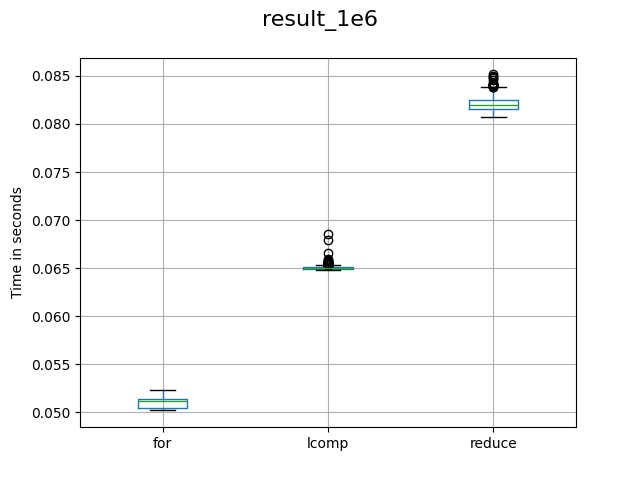

# Python Iteration Test

Testing ways to iterate over a list of dictionaries

Python has three major ways to iterate over a list: `for-loop`, `map/reduce`, and `list-comprehension`.
However, it was not clear to me what is the performance (in time) between these three ways of iteration.

The source code in this repository implements a Python-only way to analyze the performance of `for-loop`, `map/reduce`, and `list-comprehension` in a scenario of iterating over a list of Python's dictionaries performing multiplication and sum operations.

I tested three sizes of lists: `100`, `1,000` and `1,000,000` for each type of iteration. The tests were run `1,000` times for each size of the list. The tests were run in Arch Linux distribution with Python `3.11.6`.

Overall, the results indicate that `for-loop` is faster than `list-comprehension` which is faster than `map/reduce`.

Result for the `1,000,000` list size case:


## Case Tested

The test performed was the total value calculation of a list of products. 
Each product has a quantity and a price.
The iteration should calculate the total value performing `total = ∑ Qi * Pi`,
where `Qi` is the quantity of the product `i`, and `Pi` is the price of the product `i`.

Below you can see the basic schema of the dictionary.

```python
{
    "product": str,
    "qty": int,
    "price": int
}
```

## How to run the tests

If you want to run all the tests you can run:
```
python run_tests.py
```

If you want to run a specific case you can run
```
python pyitertest.py <size> <times> {for | reduce | lcomp}
```

## How to generate the plots

You will need to install `matplotlib` and `pandas`. You can use the same version used in the tests by creating a virtual environment and installing the dependencies on `requirements.txt`.

To generate the plots you can run:
```
python data_analisys.py
```